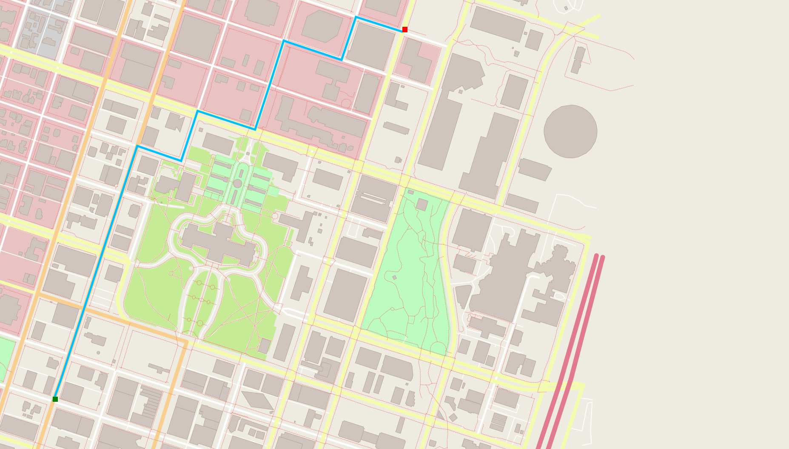

# My Route Planning Project

This is a project from udacity C++ nanodegree program. This project uses the open-source map as a library with some modification, I am able to perform an A* search to look for a path from one point to the other.



## Installing the dependencies

To build this project locally, you will need to install the io2d library package from `https://github.com/cpp-io2d/P0267_RefImpl`.

```bash
sudo apt install libcairo2-dev
sudo apt install libgraphicsmagick1-dev
sudo apt install libpng-dev

git clone --recurse-submodules https://github.com/cpp-io2d/P0267_RefImpl.git
cd P0267_RefImpl
mkdir Debug
cd Debug
cmake --config Debug "-DCMAKE_BUILD_TYPE=Debug" ..
cmake --build .

make
sudo make install
```

Note that you will not be able to compile and install the above packages smoothly if you are using Ubuntu 16.04. As you will need g++-7 to successfully compile the libray. Follow the instructions below to install g++-7 in your computer.

g++-7 - For c++ programs (use this)
gcc-7 - For c programs (install for your own use)

```sh
sudo apt-get install -y software-properties-common
# Install tool chain to find g++-7 and gcc-7 in apt
sudo add-apt-repository ppa:ubuntu-toolchain-r/test
sudo apt-get udpate
sudo apt-get install g++-7 gcc-7 -y

# Remove g++ or gcc if you have them
sudo update-alternatives --remove-all g++
sudo update-alternatives --remove-all gcc

# Add in new g++ and gcc
sudo update-alternatives --install /usr/bin/gcc gcc /usr/bin/gcc-7 60 \
--slave /usr/bin/g++ g++ /usr/bin/g++-7

# Choose your g++ or gcc (if you already remove them by default you only have one gcc)
sudo update-alternatives --config gcc

# Check your g++ and gcc version
g++ --version
gcc --version
```

A quick fix without doing the above configurations, but you still need to install g++-7, is to add a line in the main CMakeLists.txt.

```cmake
cmake_minimum_required(VERSION 3.0.0)

# ADD THE BELOW LINE
set(CMAKE_CXX_COMPILER /usr/bin/g++-7)

if(NOT TESTING)
    set(TESTING "notest")
endif()

message("TESTING = ${TESTING}")

# The rest of the CMakeLists.txt remains unchanged
```

## Compiling and Running

### Compiling
To compile the project, first, create a `build` directory and change to that directory:
```sh
mkdir build && cd build
# From within the `build` directory, then run `cmake` and `make` as follows:
cmake ..
make    # Or `cmake --build .` this is to ignore the maker, whether cmake uses make or other tool it does matter to us
```

### Running
The executables will be placed in the `bin` directory. From within `build`, you can run the project as follows:
```
../bin/my-route-planning-project -f ../map.osm
```

## Testing

For exercises that have unit tests, the project must be built with the approprate test cpp file. This can be done by passing a string with the `-DTESTING` flag in `cmake`. For example, from the build directory:
```
cmake -DTESTING="RouteModel" ..
make
```
Those commands will build the code with the tests for the "Fill Out Route Model" exercise. The tests can then be run from the `build` directory as follows:
```
../bin/test
```
Exercises with tests will specify which string to pass with `-DTESTING`, but a table is given below with the complete list for reference:

| Exercise Name               | `-DTESTING` String Value | Faulty |
|-----------------------------|:------------------------:|--------|
| Fill Out Route Model        |       "RouteModel"       | yes |
| Fill Out Node Class         |       "RMNodeClass"      | yes |
| Create RouteModel Nodes     |        "RMSNodes"        | yes |
| Write the Distance Function |        "NodeDist"        | no  |
| Create Road to Node Hashmap |       "NodeToRoad"       | no  |
| Write FindNeighbors         |      "FindNeighbors"     | no  |
| Find the Closest Node       |       "FindClosest"      | no  |
| Write the A\* Search Stub   |        "AStarStub"       | no  |
| Finish A\* Search           |       "AStarSearch"      | no  |

Note that for `RouteMode` and some other unit test, they are faulty and does not provide the correct evaluation. You may check `AStarSearch` for the your final code, if it can pass the test means your code is not faulty.
